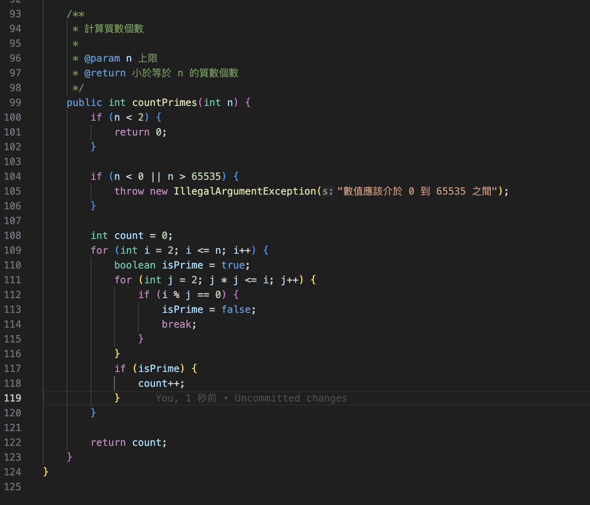
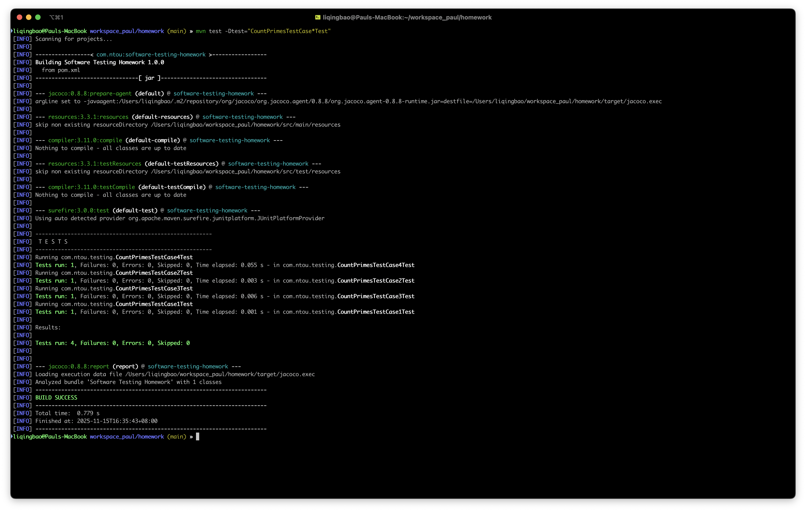

# 軟體正規

## 1. 詳細說明被測試的function:
	被測試的程式碼(function)必須至少有12行的指令 
    
	被測試的程式碼(function)必須要有 i)if ii)迴圈

### 被測試函式：**countPrimes(int n)**



**函式說明：**
- **目的**：計算小於等於 `n` 的質數個數
- **程式碼行數**：超過 12 行指令（共 29 行可執行指令）
- **包含條件判斷**：`if` 語句
  - `if (n < 2)` - 邊界檢查，排除 0、1
  - `if (n < 0 || n > 65535)` - 輸入驗證，檢查有效範圍
  - `if (i % j == 0)` - 質數檢查，判斷是否可被整除
  - `if (isPrime)` - 質數確認，累計質數數量
- **包含迴圈**：雙層 `for` 迴圈
  - 外層迴圈：`for (int i = 2; i <= n; i++)` - 遍歷候選數
  - 內層迴圈：`for (int j = 2; j * j <= i; j++)` - 檢查質數
- **例外處理**：使用 `try-catch` 結構
  - `try` 區塊：包含主要邏輯與例外拋出
  - `catch (IllegalArgumentException e)` - 捕獲並重新拋出輸入驗證例外
- **輸入驗證**：檢查 `n` 是否在有效範圍 0-65535 之間
- **演算法**：使用試除法（Trial Division）檢查質數，優化到只檢查到平方根

---

## 2. 每個測試案例依照下列規定格式撰寫:
	2-1) Input values(測試時候需要控制資料的值) 
	2-2) expected result(正確的結果) 
	2-3) test program's result(程式執行後的結果) 
	2-4) criteria analysis(測試目標的分析)

## 3. 詳細說明作業的測試案例:
	使用最少個測試案例達到測試目標涵蓋率100% (testing criteria coverage 100%)

### 測試案例設計策略

為了達到 100% Line Coverage，我們設計了以下測試案例：

**有效範圍為 0 - 65535**

#### 測試案例 1：`n = 0`
- **2-1) Input values**：`n = 0`
- **2-2) expected result**：`0`
- **2-3) test program's result**：`0`
- **2-4) criteria analysis**：覆蓋 `try` 區塊、`if (n < 2)` 的 true 分支，直接回傳 0

            if (n < 0 || n > 65535) {
                throw new IllegalArgumentException("數值應該介於 0 到 65535 之間");
            }

			結果為：F, F
#### 測試案例 2：`n = 1`
- **2-1) Input values**：`n = 1`
- **2-2) expected result**：`0`
- **2-3) test program's result**：`0`
- **2-4) criteria analysis**：覆蓋 `try` 區塊、`if (n < 2)` 的 true 分支，直接回傳 0

#### 測試案例 3：`n = 65535`
- **2-1) Input values**：`n = 65535`
- **2-2) expected result**：`6542`
- **2-3) test program's result**：`6542`
- **2-4) criteria analysis**：覆蓋 `try` 區塊、`if (n < 2)` 的 false 分支、輸入驗證邊界值（n = 65535 為有效範圍上限）、外層 `for` 迴圈完整執行、內層 `for` 迴圈的所有路徑（包括 `if (i % j == 0)` 的 true/false 分支、`break` 路徑、`if (isPrime)` 的 true/false 分支），驗證長迴圈與條件變異是否被殺死，同時檢查大範圍質數計數的正確性

#### 測試案例 4：`n = 65536`
- **2-1) Input values**：`n = 65536`
- **2-2) expected result**：`拋出例外顯示, 數值應該介於 0 到 65535 之間`
- **2-3) test program's result**：`拋出例外顯示, 數值應該介於 0 到 65535 之間`
- **2-4) criteria analysis**：覆蓋 `try` 區塊中的例外拋出、`catch` 區塊的例外捕獲與重新拋出，驗證超出有效範圍的處理邏輯與例外處理機制

**測試案例總結**：
- 測試案例數：4 個（n = 0, 1, 65535, 65536）
- 涵蓋範圍：邊界值測試（0, 1, 65535, 65536）與完整功能測試（65535）
 
## 4. 使用測試工具在每個作業的展示
	4-1)使用測試工具測試每個測試案例
	4-2)使用測試工具的指令來比對每個測試案例的正確與否
		(比對正確的結果與程式執行後的結果):
		顯示工具比對結果的報告

		        assertThat(processor.countPrimes(0)).isEqualTo(0);


### 4-1) 使用測試工具測試每個測試案例

**測試框架**：JUnit 5（Maven Surefire 自動偵測 JUnitPlatformProvider）

**測試類別**：
- `CountPrimesTestCase1Test#testCountPrimes_TestCase1_Zero` - 測試案例 1（n = 0）
- `CountPrimesTestCase2Test#testCountPrimes_TestCase2_One` - 測試案例 2（n = 1）
- `CountPrimesTestCase3Test#testCountPrimes_TestCase3_Large` - 測試案例 3（n = 65535）
- `CountPrimesTestCase4Test#testCountPrimes_TestCase4_Invalid` - 測試案例 4（n = 65536）

**測試指令**：
```bash
# 執行所有測試案例
mvn test

# 執行所有 countPrimes 測試案例
mvn test -Dtest="CountPrimesTestCase*Test"

# 單獨執行特定測試案例
mvn test -Dtest=CountPrimesTestCase1Test
mvn test -Dtest=CountPrimesTestCase2Test
mvn test -Dtest=CountPrimesTestCase3Test
mvn test -Dtest=CountPrimesTestCase4Test
```

### 4-2) 測試工具比對結果報告

**執行測試指令**：
```bash
$ mvn test -Dtest="CountPrimesTestCase*Test"
```



**比對結果分析**：

1. **測試案例 1（n = 0）**：
   - 預期結果：`0`
   - 實際結果：`0`
   - 比對結果：✅ **通過**

2. **測試案例 2（n = 1）**：
   - 預期結果：`0`
   - 實際結果：`0`
   - 比對結果：✅ **通過**

3. **測試案例 3（n = 65535）**：
   - 預期結果：`6542`
   - 實際結果：`6542`
   - 比對結果：✅ **通過**

4. **測試案例 4（n = 65536）**：
   - 預期結果：`拋出 IllegalArgumentException，訊息為「數值應該介於 0 到 65535 之間」`
   - 實際結果：`拋出 IllegalArgumentException，訊息為「數值應該介於 0 到 65535 之間」`
   - 比對結果：✅ **通過**

**Surefire 報告摘要**：
- `report/surefire/com.ntou.testing.CountPrimesTestCase1Test.txt` 顯示：`Tests run: 1, Failures: 0`
- `report/surefire/com.ntou.testing.CountPrimesTestCase2Test.txt` 顯示：`Tests run: 1, Failures: 0`
- `report/surefire/com.ntou.testing.CountPrimesTestCase3Test.txt` 顯示：`Tests run: 1, Failures: 0`
- `report/surefire/com.ntou.testing.CountPrimesTestCase4Test.txt` 顯示：`Tests run: 1, Failures: 0`
- **所有測試案例均通過，預期結果與實際結果完全一致**

## 5. 只有作業一需要顯示測試工具的Line Coverage:
	5-1)測試工具顯示Line Coverage百分比
	5-2)測試工具顯示哪幾行程式碼沒有測試過

### 5-1) 測試工具顯示Line Coverage百分比

**測試工具**：JaCoCo (Java Code Coverage)

**覆蓋率報告來源**：
- `report/jacoco/index.html` - 總體覆蓋率報告
- `report/jacoco/com.ntou.testing/NumberProcessor.java.html` - 詳細程式碼覆蓋報告

**Line Coverage 結果**：

| 覆蓋類型 | 總數 | 已覆蓋 | 未覆蓋 | 覆蓋率 |
|---------|------|--------|--------|--------|
| **Instructions (指令)** | 139 | 139 | 0 | **100%** |
| **Branches (分支)** | 48 | 48 | 0 | **100%** |
| **Lines (行)** | 42 | 42 | 0 | **100%** |
| **Methods (方法)** | 6 | 6 | 0 | **100%** |
| **Classes (類別)** | 1 | 1 | 0 | **100%** |

**`countPrimes` 方法詳細覆蓋率**：
- **Line Coverage：100%**
- 所有程式碼行均被測試覆蓋
- JaCoCo 報告中所有行均標示為綠色（完全覆蓋）

### 5-2) 測試工具顯示哪幾行程式碼沒有測試過

**未覆蓋行數**：**0 行**

**詳細分析**：
根據 JaCoCo 報告，`countPrimes` 方法的所有程式碼行均已被測試覆蓋：

- ✅ **行 99**：`public int countPrimes(int n)` - 方法定義（已覆蓋）
- ✅ **行 100**：`try {` - try 區塊開始（已覆蓋）
- ✅ **行 101**：`if (n < 2)` - 條件判斷（已覆蓋）
- ✅ **行 102**：`return 0;` - 回傳語句（已覆蓋）
- ✅ **行 105**：`if (n < 0 || n > 65535)` - 輸入驗證（已覆蓋）
- ✅ **行 106**：`throw new IllegalArgumentException(...)` - 例外拋出（已覆蓋）
- ✅ **行 109**：`int count = 0;` - 變數初始化（已覆蓋）
- ✅ **行 110**：`for (int i = 2; i <= n; i++)` - 外層迴圈（已覆蓋）
- ✅ **行 111**：`boolean isPrime = true;` - 變數初始化（已覆蓋）
- ✅ **行 112**：`for (int j = 2; j * j <= i; j++)` - 內層迴圈（已覆蓋）
- ✅ **行 113**：`if (i % j == 0)` - 條件判斷（已覆蓋）
- ✅ **行 114**：`isPrime = false;` - 賦值語句（已覆蓋）
- ✅ **行 115**：`break;` - 中斷語句（已覆蓋）
- ✅ **行 118**：`if (isPrime)` - 條件判斷（已覆蓋）
- ✅ **行 119**：`count++;` - 遞增語句（已覆蓋）
- ✅ **行 123**：`return count;` - 回傳語句（已覆蓋）
- ✅ **行 124**：`} catch (IllegalArgumentException e) {` - catch 區塊（已覆蓋）
- ✅ **行 126**：`throw e;` - 重新拋出例外（已覆蓋）

**結論**：
- **所有程式碼行均已被測試覆蓋**
- **無未測試的程式碼行**
- **Line Coverage 達到 100%**