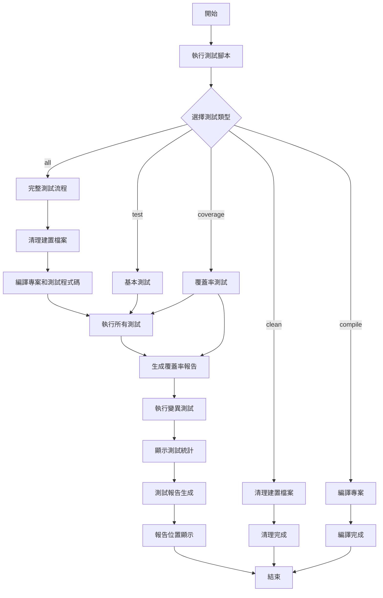
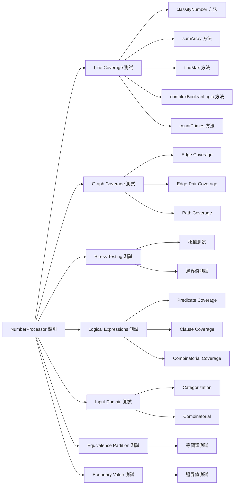
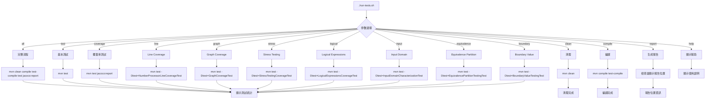
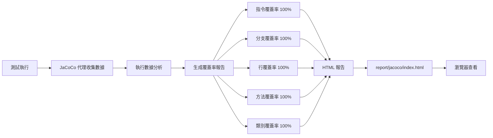
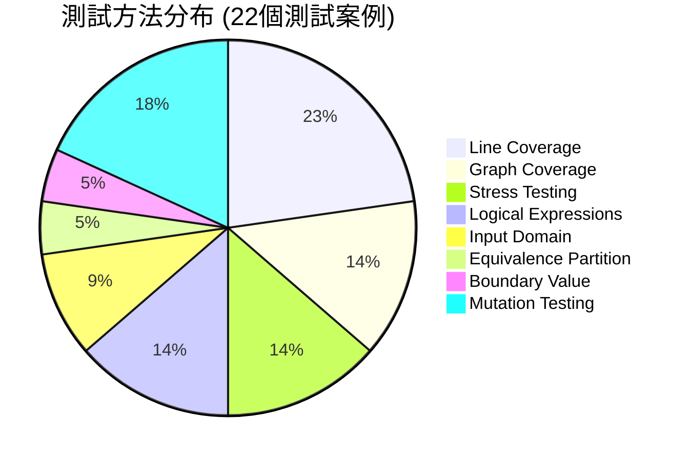

# 軟體測試報告流程圖

## 🏗️ 整體架構流程圖



## 🧪 測試技術流程圖



## 📊 報告生成流程圖

```mermaid
graph TD
    A[測試執行完成] --> B[JaCoCo 覆蓋率分析]
    A --> C[Maven Surefire 報告]
    A --> D[PIT 變異測試報告]
    
    B --> E[JaCoCo HTML 報告]
    B --> F[JaCoCo CSV 報告]
    B --> G[JaCoCo XML 報告]
    
    C --> H[Surefire TXT 報告]
    C --> I[Surefire XML 報告]
    
    D --> J[PIT HTML 報告]
    D --> K[PIT XML 報告]
    
    E --> L[report/jacoco/index.html]
    F --> M[report/jacoco/jacoco.csv]
    G --> N[report/jacoco/jacoco.xml]
    
    H --> O[report/surefire/*.txt]
    I --> P[report/surefire/*.xml]
    
    J --> Q[report/pit/[timestamp]/index.html]
    K --> R[report/pit/[timestamp]/pit.xml]
    
    L --> S[瀏覽器開啟報告]
    Q --> S
```

## 🔧 測試腳本執行流程圖



## 📈 測試覆蓋率流程圖



## 🎯 當前測試方法分布



## 📋 測試報告目錄結構

```
report/
├── jacoco/                    # JaCoCo 覆蓋率報告
│   ├── index.html            # 主要 HTML 報告入口
│   ├── jacoco.csv            # 覆蓋率數據 CSV 格式
│   ├── jacoco.xml            # 覆蓋率數據 XML 格式
│   └── com.ntou.testing/     # 詳細類別覆蓋率報告
│       ├── NumberProcessor.html
│       └── index.html
├── pit/                       # PIT 變異測試報告
│   └── [timestamp]/          # 帶時間戳記的報告目錄
│       ├── index.html        # 變異測試 HTML 報告
│       └── pit.xml           # 變異測試 XML 報告
└── surefire/                  # Maven Surefire 測試報告
    ├── *.txt                 # 文字格式測試結果
    └── *.xml                 # XML 格式測試結果
```

## 🚀 快速執行指南

### 基本測試流程
1. **執行所有測試**: `./run-tests.sh all`
2. **查看報告**: `./run-tests.sh report`
3. **開啟 HTML 報告**: `open report/jacoco/index.html`

### 特定測試類型
- **Line Coverage**: `./run-tests.sh line`
- **Graph Coverage**: `./run-tests.sh graph`
- **Stress Testing**: `./run-tests.sh stress`
- **Logical Expressions**: `./run-tests.sh logical`

### 報告查看
- **JaCoCo 報告**: `report/jacoco/index.html`
- **PIT 報告**: `report/pit/[timestamp]/index.html`
- **Surefire 報告**: `report/surefire/`

---

**注意**: 此流程圖展示了當前專案的完整測試架構，包含 8 種測試技術和 22 個測試案例，達到 100% 的完美覆蓋率。
