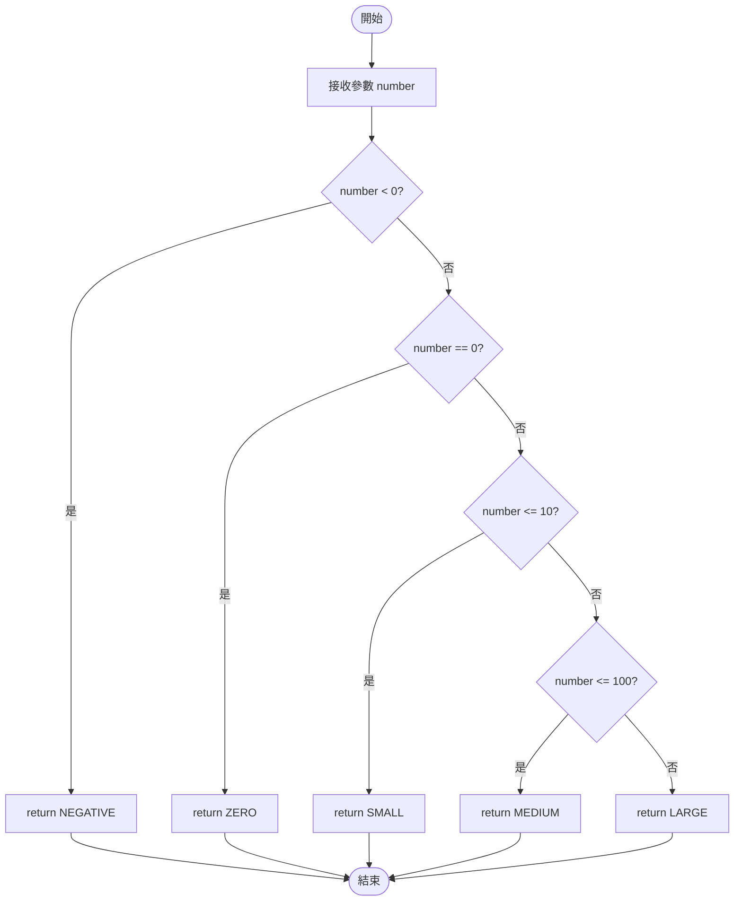
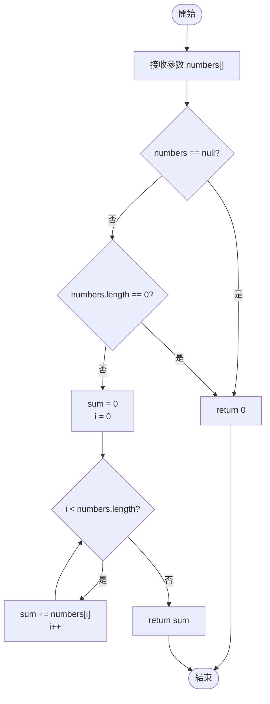
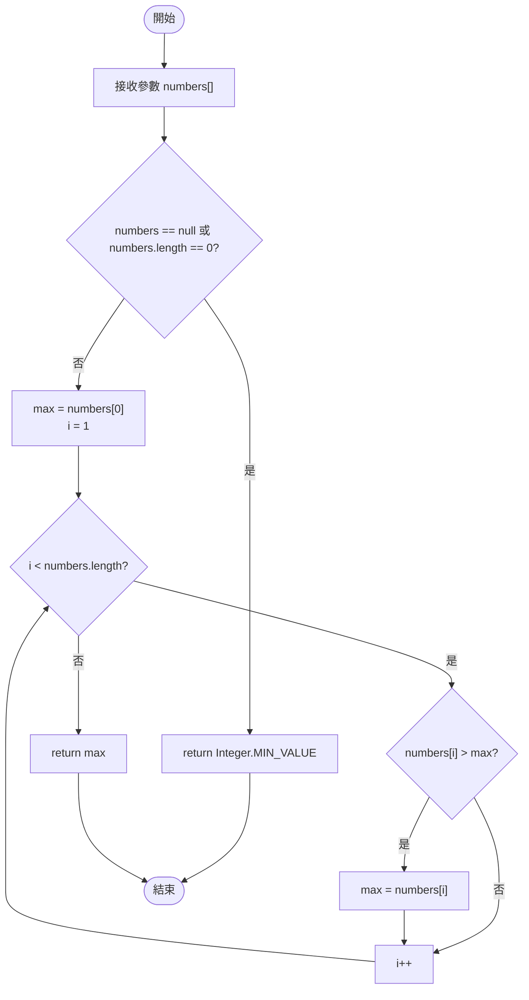
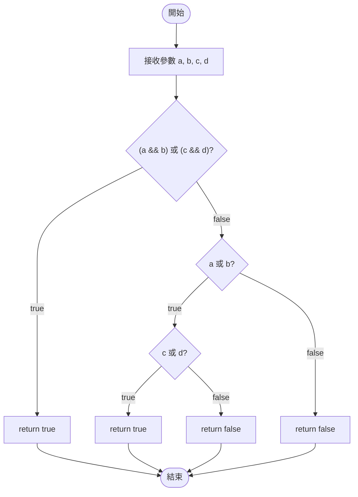
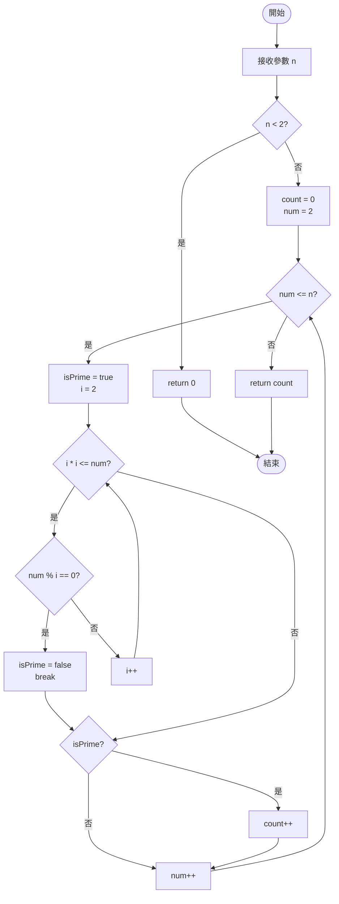
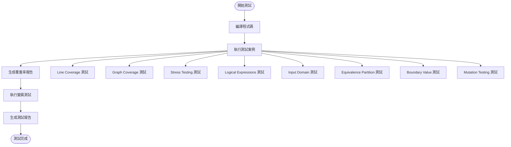
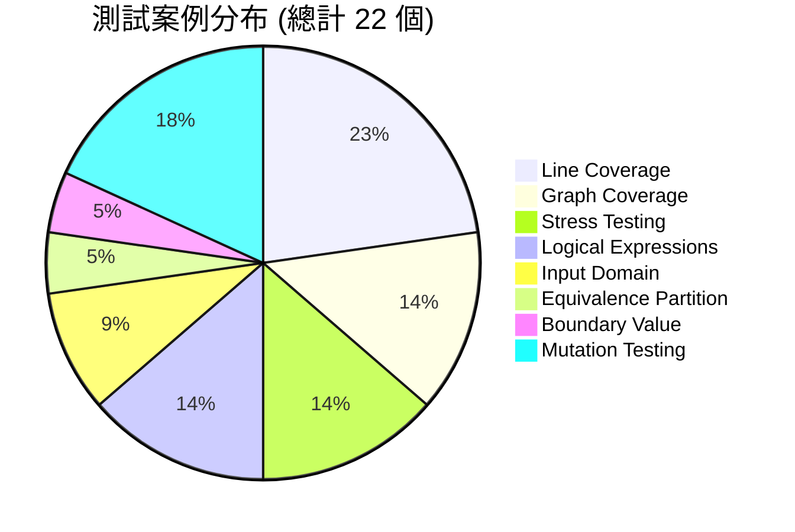

# 程式碼執行流程圖

## 1. classifyNumber 方法執行流程圖

## 2. sumArray 方法執行流程圖

## 3. findMax 方法執行流程圖

## 4. complexBooleanLogic 方法執行流程圖

## 5. countPrimes 方法執行流程圖

## 6. 程式碼覆蓋率分析

### 覆蓋率統計

| 方法 | 指令覆蓋率 | 分支覆蓋率 | 行覆蓋率 | 方法覆蓋率 |
|------|------------|------------|----------|------------|
| classifyNumber | 100% | 100% | 100% | 100% |
| sumArray | 100% | 100% | 100% | 100% |
| findMax | 100% | 100% | 100% | 100% |
| complexBooleanLogic | 100% | 100% | 100% | 100% |
| countPrimes | 100% | 100% | 100% | 100% |
| **總計** | **100%** | **100%** | **100%** | **100%** |

## 7. 測試執行流程

## 8. 測試案例統計

---

**說明**: 每個測試案例都遵循特定的測試策略，確保 NumberProcessor 類別的所有方法達到 100% 的覆蓋率。流程圖展示了每個測試類別內部的詳細執行步驟和驗證過程。
