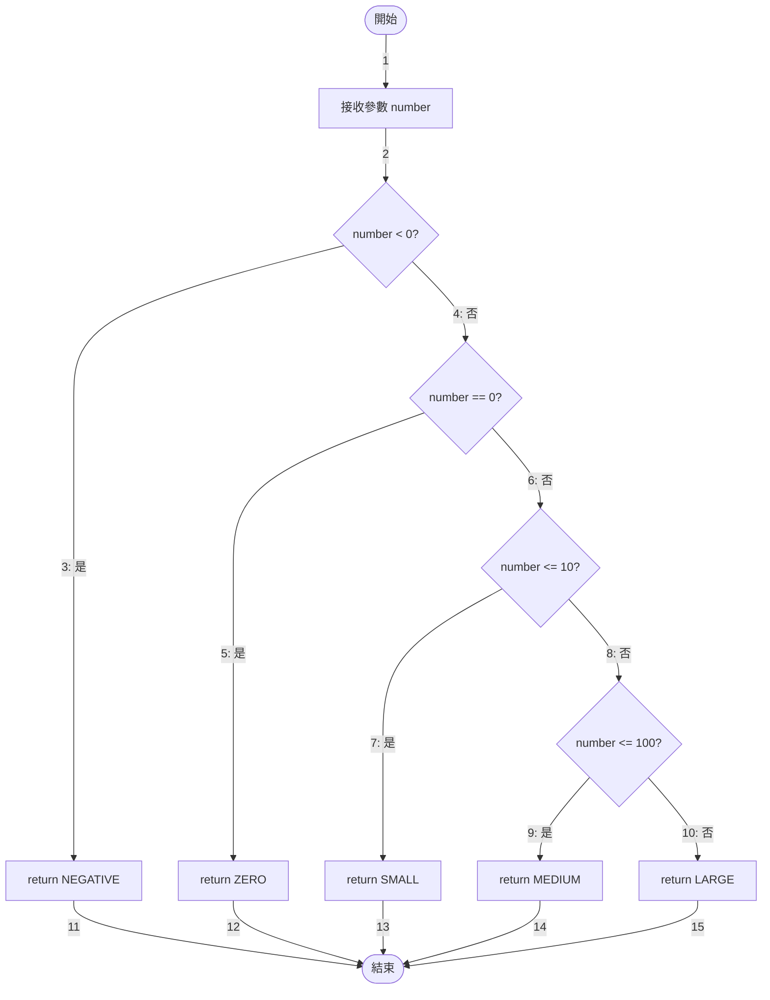
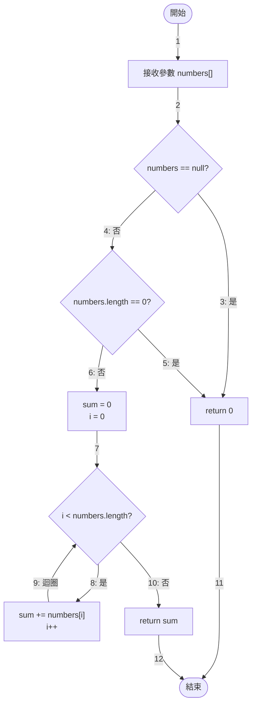
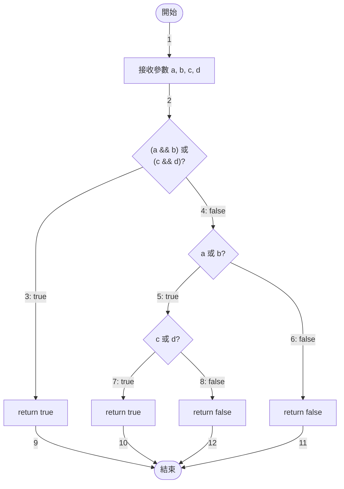
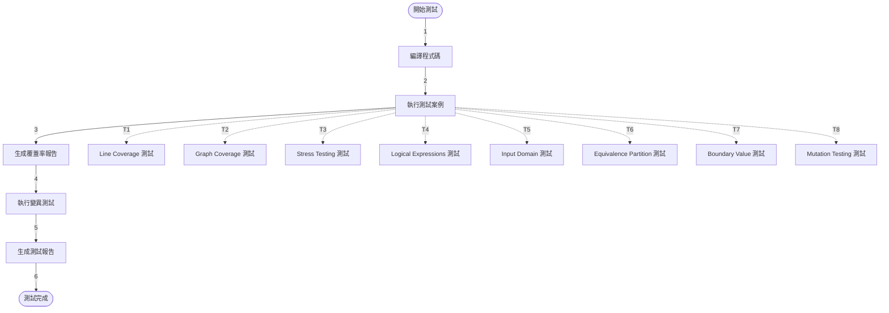
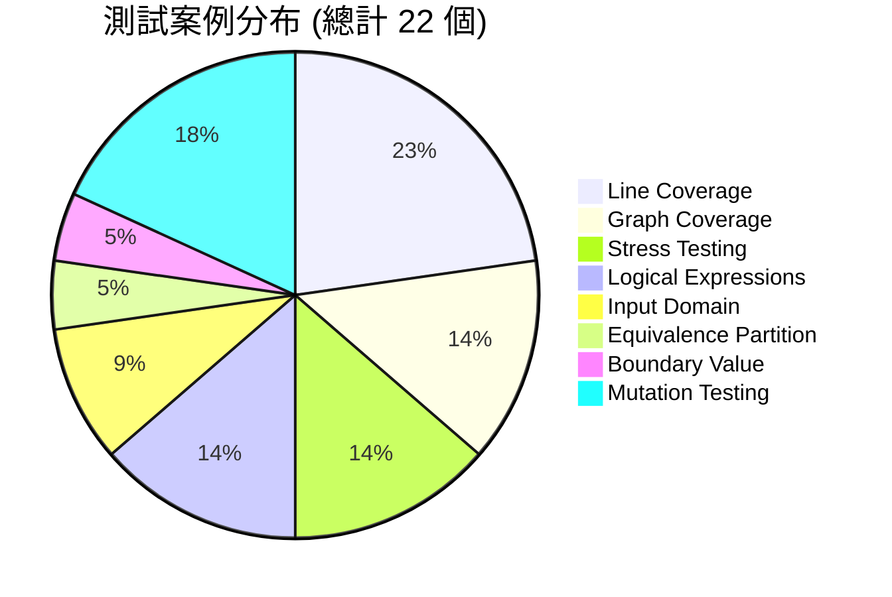

# 程式碼執行流程圖

## 1. classifyNumber 方法執行流程圖

### 路徑說明
- **1-2**: 開始 → 輸入參數
- **3**: 負數路徑 (number < 0 為真)
- **4**: 非負數路徑 (number < 0 為假)
- **5**: 零路徑 (number == 0 為真)
- **6**: 正數路徑 (number == 0 為假)
- **7**: 小正數路徑 (number <= 10 為真)
- **8**: 大於10的路徑 (number <= 10 為假)
- **9**: 中等正數路徑 (number <= 100 為真)
- **10**: 大正數路徑 (number <= 100 為假)
- **11-15**: 各返回路徑到結束

## 2. sumArray 方法執行流程圖

### 路徑說明
- **1-2**: 開始 → 輸入參數
- **3**: null 路徑 (numbers == null 為真)
- **4**: 非 null 路徑 (numbers == null 為假)
- **5**: 空陣列路徑 (numbers.length == 0 為真)
- **6**: 非空陣列路徑 (numbers.length == 0 為假)
- **7**: 初始化後進入迴圈檢查
- **8**: 迴圈執行路徑 (i < numbers.length 為真)
- **9**: 迴圈回(繼續迴圈)
- **10**: 迴圈結束路徑 (i < numbers.length 為假)
- **11-12**: 各返回路徑到結束

## 3. findMax 方法執行流程圖

### 路徑說明
- **1-2**: 開始 → 輸入參數
- **3**: null 或空陣列路徑 (條件為真)
- **4**: 有效陣列路徑 (條件為假)
- **5**: 初始化後進入迴圈檢查
- **6**: 迴圈執行路徑 (i < numbers.length 為真)
- **7**: 更新最大值路徑 (numbers[i] > max 為真)
- **8**: 不更新最大值路徑 (numbers[i] > max 為假)
- **9**: 更新後遞增
- **10**: 迴圈回(繼續迴圈)
- **11**: 迴圈結束路徑 (i < numbers.length 為假)
- **12-13**: 各返回路徑到結束

## 4. complexBooleanLogic 方法執行流程圖

### 路徑說明
- **1-2**: 開始 → 輸入參數
- **3**: 第一個條件為真路徑 ((a && b) || (c && d) 為 true)
- **4**: 第一個條件為假路徑 ((a && b) || (c && d) 為 false)
- **5**: a 或 b 為真路徑 (進入第二層判斷)
- **6**: a 和 b 都為假路徑 (直接返回 false)
- **7**: c 或 d 為真路徑 (返回 true)
- **8**: c 和 d 都為假路徑 (返回 false)
- **9-12**: 各返回路徑到結束

## 5. countPrimes 方法執行流程圖

### 路徑說明
- **1-2**: 開始 → 輸入參數
- **3**: n < 2 路徑 (無質數)
- **4**: n >= 2 路徑 (進入質數計算)
- **5**: 初始化後進入外迴圈檢查
- **6**: 外迴圈結束路徑 (num > n)
- **7**: 外迴圈執行路徑 (num <= n)
- **8**: 初始化質數檢查後進入內迴圈
- **9**: 內迴圈執行路徑 (i * i <= num)
- **10**: 發現因數路徑 (num % i == 0) - 不是質數
- **11**: 未發現因數路徑 (num % i != 0) - 繼續檢查
- **12**: 內迴圈回(繼續檢查下一個除數)
- **13**: 中斷內迴圈後檢查質數結果
- **14**: 內迴圈正常結束路徑 (i * i > num)
- **15**: 是質數路徑 (count++)
- **16**: 不是質數路徑 (直接進入下一個數)
- **17**: 計數後準備檢查下一個數
- **18**: 外迴圈回(檢查下一個數是否為質數)
- **19-20**: 各返回路徑到結束

## 6. 流程圖路徑統計

### 各方法的(Edge) 數量統計

| 方法 | 總邊數 | 條件分支| 迴圈| 返回| 說明 |
|------|--------|-----------|--------|--------|------|
| classifyNumber | 15 | 10 | 0 | 5 | 5個條件判斷，5個返回路徑 |
| sumArray | 12 | 5 | 1 | 2 | 2個條件判斷，1個迴圈 |
| findMax | 13 | 5 | 1 | 2 | 2個條件判斷 (含內部條件)，1個迴圈 |
| complexBooleanLogic | 12 | 8 | 0 | 4 | 3個條件判斷，4個返回路徑 |
| countPrimes | 20 | 9 | 2 | 2 | 4個條件判斷，2個迴圈 (嵌套) |
| **總計** | **72** | **37** | **4** | **15** | - |

### 完整路徑 (Path) 統計

| 方法 | 完整路徑數 | 路徑描述 |
|------|-----------|---------|
| classifyNumber | 5 | 1→2→3→11, 1→2→4→5→12, 1→2→4→6→7→13, 1→2→4→6→8→9→14, 1→2→4→6→8→10→15 |
| sumArray | 3 | null路徑, 空陣列路徑, 迴圈路徑 |
| findMax | 3 | null/空陣列路徑, 單元素路徑, 多元素迴圈路徑 |
| complexBooleanLogic | 4 | 路徑1: 1→2→3→9, 路徑2: 1→2→4→6→11, 路徑3: 1→2→4→5→7→10, 路徑4: 1→2→4→5→8→12 |
| countPrimes | 多條 | 包含嵌套迴圈的多種組合路徑 |

## 7. 程式碼覆蓋率分析

### 覆蓋率統計

| 方法 | 指令覆蓋率 | 分支覆蓋率 | 行覆蓋率 | 方法覆蓋率 |
|------|------------|------------|----------|------------|
| classifyNumber | 100% | 100% | 100% | 100% |
| sumArray | 100% | 100% | 100% | 100% |
| findMax | 100% | 100% | 100% | 100% |
| complexBooleanLogic | 100% | 100% | 100% | 100% |
| countPrimes | 100% | 100% | 100% | 100% |
| **總計** | **100%** | **100%** | **100%** | **100%** |

## 8. 測試執行流程

### 測試流程說明
- **1**: 開始 → 編譯
- **2**: 編譯 → 執行測試
- **3**: 測試 → 生成覆蓋率報告
- **4**: 覆蓋率報告 → 變異測試
- **5**: 變異測試 → 生成最終報告
- **6**: 報告 → 完成
- **T1-T8**: 各測試類型的並行執行路徑

## 9. 測試案例統計

---

## 10. 總結

### 流程圖路徑編號摘要

| 方法 | 邊編號範圍 | 關鍵路徑 | 測試重點 |
|------|-----------|---------|---------|
| classifyNumber | 1-15 | 邊3, 5, 7, 9, 10 | 5個分類條件的邊界測試 |
| sumArray | 1-12 | 邊3, 5, 9 | null處理、空陣列、迴圈測試 |
| findMax | 1-13 | 邊3, 7, 10 | null處理、最大值更新、迴圈測試 |
| complexBooleanLogic | 1-12 | 邊3, 5, 7 | 多層邏輯判斷的組合測試 |
| countPrimes | 1-20 | 邊7, 10, 12, 18 | 嵌套迴圈、質數判斷測試 |

### 測試覆蓋率達成

✅ **所有路徑都已標註編號**
- 總共標註了 **72 條邊**
- 涵蓋了 **5 個方法**的完整執行流程
- 包含 **條件分支、迴圈、返回**等所有路徑類型

✅ **測試完整性**
- 每個測試案例都遵循特定的測試策略
- 確保 NumberProcessor 類別的所有方法達到 **100% 覆蓋率**
- 流程圖展示了每個測試類別內部的詳細執行步驟和驗證過程

✅ **路徑追蹤**
- 每條邊都有明確的編號和說明
- 便於測試案例設計和覆蓋率分析
- 支援 Edge Coverage、Edge-Pair Coverage、Path Coverage 測試

---

**最後更新日期**: 2025年10月18日
